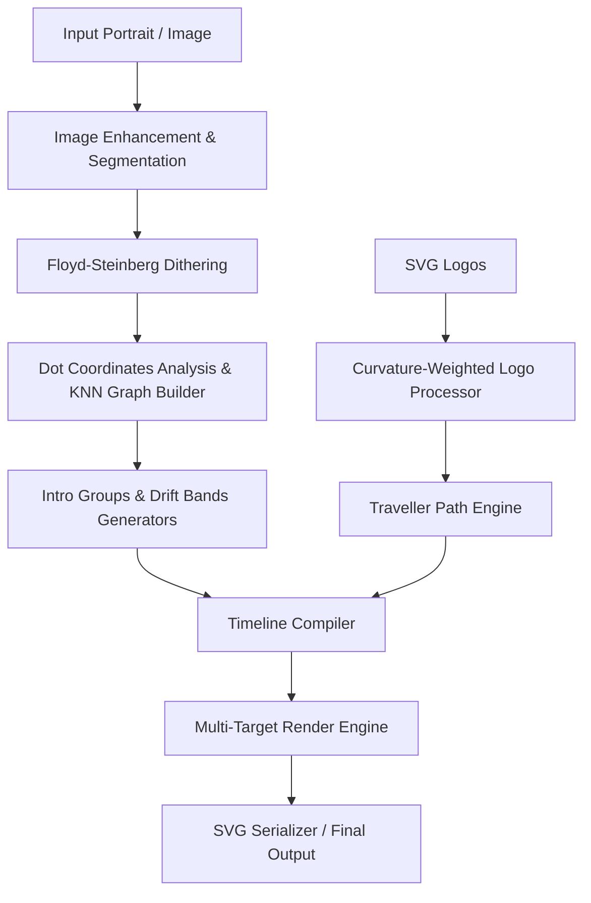

<<<<<<< HEAD


<!-- ===== THEME-AWARE HERO BANNER ===== -->
<!-- GitHub automatically shows dark.svg in dark mode and light.svg in light mode -->


<!-- ===== GITHUB STATS ===== -->

<p align="center">

</p>

<!-- Streak — full width -->
<picture>
  <source media="(prefers-color-scheme: dark)" srcset="https://streak-stats.demolab.com/?user=shxam69&hide_border=true&background=0A101F&stroke=22D3EE&ring=A78BFA&fire=10B981&currStreakLabel=22D3EE&sideLabels=94A3B8&currStreakNum=F8FAFC&sideNums=F8FAFC&dates=64748B&titleColor=22D3EE&card_width=1180" />
  
</picture>

<br/>

<!-- Stats + Top languages — side by side -->
<picture>
  <source media="(prefers-color-scheme: dark)" srcset="https://github-readme-stats-sigma-rosy-28.vercel.app/api?username=shxam69&show_icons=true&count_private=true&include_all_commits=true&hide_rank=true&hide_border=true&title_color=22D3EE&icon_color=A78BFA&text_color=94A3B8&bg_color=0A101F&card_width=500" />
  
</picture>
<picture>
  <source media="(prefers-color-scheme: dark)" srcset="https://github-readme-stats-sigma-rosy-28.vercel.app/api/top-langs/?username=shxam69&layout=compact&langs_count=8&hide_border=true&title_color=22D3EE&text_color=94A3B8&bg_color=0A101F&card_width=500" />
  
</picture>

</div>

<!-- ===== CONTRIBUTION SNAKE ===== -->

<div align="center">

<picture>
  <source media="(prefers-color-scheme: dark)" srcset="https://raw.githubusercontent.com/shxam69/shxam69/output/snake-dark.svg" />
  <source media="(prefers-color-scheme: light)" srcset="https://raw.githubusercontent.com/shxam69/shxam69/output/snake-light.svg" />
  
</picture>

</div>
<!-- ===================== LEETCODE ===================== -->

<div align="center">

<h2>🧩 LeetCode Stats</h2>

<p>
<i>Sharpening problem-solving skills one challenge at a time.</i>
</p>

<a href="https://leetcode.com/u/SHYAM-A/">

</a>

</div>


<!-- ===== END SNAKE ===== -->
<br/>
<br/>
<div align="center">

</div>


<!-- ===== SOCIAL BADGES ===== -->
<br/>
<div align="center">

<a href="https://www.linkedin.com/in/shxam/">
  
</a>
&nbsp;&nbsp;
<a href="https://www.instagram.com/nyxros._/">
  
</a>
&nbsp;&nbsp;
<a href="https://leetcode.com/u/SHYAM-A/">
  
</a>
&nbsp;&nbsp;
<a href="mailto:shyam666fg@gmail.com">
  
</a>
&nbsp;&nbsp;
<a href="https://update-portfolio-gamma.vercel.app" target="_blank">
  
</a>
</a>
</div>

<!-- ===== END SOCIAL BADGES ===== -->
=======
# Particle Morph SVG Engine

[](https://github.com/shxam69/github-profile-generator/actions/workflows/validate.yml)
[](https://opensource.org/licenses/MIT)

A high-performance particle compiler and renderer designed to compile custom images and vector SVGs into dynamic, interactive, and lightweight particle morph animations embedded within a single vector SVG file. 

Perfect for enhancing developer portfolios, landing pages, interactive dashboards, GitHub profiles, and digital branding assets.

---

## Features

- ⚡ **Seamless Morphing Transitions**: Computes optimal particle transport routes using advanced linear matching algorithms to seamlessly morph particles between complex geometric shapes.
- 🎨 **Feature-Aware Sampling**: Leverages Canny edges, Harris corner detection, and local curvature analysis to preserve critical outlines and sharp details of vector assets.
- 🌀 **Intro Shimmers & Idle Drift**: Generates wave-like shimmering introduction paths and organic idle background drift patterns.
- 📦 **Zero Runtime Dependencies**: Renders everything as SMIL vector markup inside a single self-contained SVG file that runs natively in any modern browser without external JS libraries.
- 🛡️ **End-to-End Validation**: Built-in verification engine checking coordinate bounds, timeline collisions, and structural SVG integrity.

---

## System Architecture



For more detailed breakdowns, explore the [docs/](file:///docs/) directory:
- [Architecture Overview](file:///docs/Architecture.md)
- [Timeline Compiler](file:///docs/TimelineCompiler.md)
- [Renderer Engine](file:///docs/Renderer.md)
- [Logo Processor](file:///docs/LogoProcessor.md)

---

## Rebranded Directory Structure

```
.
├── .github/                 # GitHub metadata and CI action workflows
├── docs/                    # Detailed engineering documentation
├── examples/                # Usage examples and frame extraction scripts
├── input/                   # Input portraits and vector SVGs
├── output/                  # Compiled JSON structures and output SVGs
├── src/                     # Source code package
│   ├── animation/           # Keyframe scheduling, groups, and drift bands
│   ├── logo/                # Feature-aware SVG point samplers
│   ├── renderer/            # Frame generators and SMIL SVG renderers
│   ├── config.py            # Global paths and coordinate dimensions
│   ├── dithering.py         # Floyd-Steinberg dithering utils
│   ├── dot_analysis.py      # Grid dot coordinate analyzers
│   ├── generator.py         # Main execution coordinator
│   ├── graph_builder.py     # KNN structural builder
│   ├── image_processing.py  # Image enhancement tools
│   ├── segmentation.py      # Subject extraction and background segmenters
│   ├── svg_builder.py       # Static SVG preview builders
│   └── validator.py         # E2E validation scripts
├── templates/               # Layout templates (e.g. terminal frame views)
├── main.py                  # Lightweight root-level entry point
├── requirements.txt         # Project package requirements
├── LICENSE                  # MIT License terms
├── CHANGELOG.md             # Project change history logs
└── ROADMAP.md               # Upcoming goals and design blueprints
```

---

## Installation

1. Clone the repository:
   ```bash
   git clone https://github.com/shxam69/github-profile-generator.git
   cd github-profile-generator
   ```

2. Create and activate a virtual environment:
   ```bash
   python -m venv .venv
   # Windows:
   .venv\Scripts\activate
   # macOS/Linux:
   source .venv/bin/activate
   ```

3. Install requirements:
   ```bash
   pip install -r requirements.txt
   ```

---

## Usage

### 1. Compile & Render the Animation
To execute the complete pipeline and compile your particle morph animation:
```bash
python main.py
```
This runs the entire image-processing, dithering, coordinate extraction, traveler path-routing, timeline compiling, and SMIL SVG rendering phases. The output will be saved to `output/animated_profile.svg`.

### 2. Run the Validator Suite
To verify the structural integrity and performance metrics of the generated assets:
```bash
python src/validator.py
```

### 3. Extract Debug Frame Previews
To export static PNG frame visualisations at specific animation timestamps:
```bash
python examples/extract_frames.py
```

---

## Performance Metrics

| Process Stage | Average Time | Memory Peak | Output Format |
| :--- | :--- | :--- | :--- |
| Preprocessing & Dithering | ~0.35s | ~15 MB | PNG |
| KNN Graph Construction | ~0.60s | ~45 MB | JSON |
| Path Assignment Routing | ~1.95s | ~60 MB | JSON |
| SMIL SVG Rendering | ~2.50s | ~120 MB | SVG (14k particles) |

---

## Contributing

We welcome contributions! Please feel free to open issues or submit pull requests. Check the [Roadmap](file:///ROADMAP.md) to see current goals.

## License

This project is licensed under the MIT License - see the [LICENSE](file:///LICENSE) file for details.
>>>>>>> 1970988 (release: Particle Morph SVG Engine v1.0)
