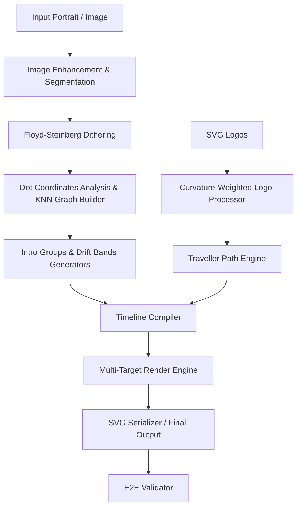

# Architecture Overview

This document describes the high-level architecture of the **Particle Morph SVG Engine**.

## Component Topology

## System Components

1. **Preprocessors (`utils/`)**:
   - **`image_processing.py`**: Performs CLAHE contrast enhancement and dual-factor unsharp-masking.
   - **`segmentation.py`**: Applies morphological closing and threshold segmentation.
   - **`dithering.py`**: Quantizes the subject space using error-diffusion.

2. **Analysis & Connection Modules (`animation/` and root)**:
   - **`dot_analysis.py`**: Extracts exact particle placement coordinates.
   - **`graph_builder.py`**: Builds geometric structures using KD-Tree and K-Nearest Neighbors.

3. **Motion Generation (`animation/`)**:
   - **`intro.py`**: Computes shimmering grouping to play custom intro waves.
   - **`drift_bands.py`**: Subdivides the particle cloud into horizontal and vertical drifting regions.
   - **`traveller.py`**: Dispatches traveler paths by solving coordinate matching between portrait and logo configurations.
   - **`compiler.py`**: Blends individual segment coordinates (intro, hold, drift, logos) into a unified, conflict-free timeline database.

4. **Serialization & Verification (`renderer/` and `validator/`)**:
   - **`renderer.py` & `svg_renderer.py`**: Evaluates active timelines and builds lightweight inline SVG SMIL (`<animate>`) tags.
   - **`validator.py`**: Audits nodes, timelines, shapes, and final SVG file outputs.
